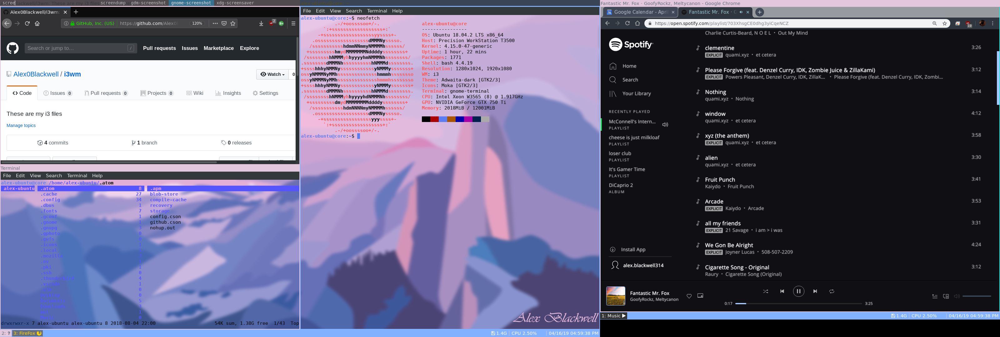

# i3wm
These are my i3 tiling window manager files. 
I have been using this tiling window manager ontop of Ubuntu and I recognize its potential for being productive. I am still learning about both GNU/Linux and i3wm and I really don't think I will ever stop learning. 
I invite whoever is viewing this to suggest improvements to the files or even use the files to improve your own files.

Below is a screenshot of what my i3wm desktop environment looks like on my dual monitor setup.

