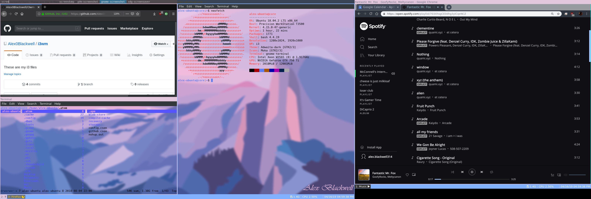

# i3wm Config

## Table of contents
* [Overview](#overview)
* [Examples](#examples)
* [Requirements](#requirements)
* [Key Bindings](#key-bindings)
* [Setup](#setup)

## Overview
This is my config for i3wm, the tiling window manager I have running on Ubuntu.  
**Note**
  - `$mod` key is `Mod1` *(Alt on most keyboards)*
    - change this to `Mod4` for Windows key on most keyboards
  - *capslock* is configured to act as backspace
    - delete *line 221* in the [config](config) file if you don't want this admittedly odd configeration
  - the i3wm default **j-k-l-;** movement keys are configured to the more Vim-familiar **h-j-k-l**

## Examples

> Screenshot of window manager on dual screen setup

## Requirements
The *config* file references the following programs:
  - [i3blocks](https://github.com/vivien/i3blocks)
    - *a feed generator for status bars*
      - required for the status bar
      - `i3blocks.conf` is the associated config file
  - [Compton](https://github.com/chjj/compton)
    - *a compositor for X11*
      - required for blur effect on windows
      - *bonus* works well at fixing screen tearing issues
The following programs are referenced in the *config* file as a shortcut
  - [Ranger](https://github.com/ranger/ranger)
    - file manager for the console
  - amixer
    - volume control
  - Firefox
  - Chrome

## Key Bindings

  | Key                                | Purpose                                                                             |
  | ---                                | -------                                                                             |
  | $mod + (1-9,0)                     | Switch to workspaces with number 1-10                                               |
  | $mod + Shift + (1-9,0)             | Move the container to the workspaces with number 1-10                               |
  | $mod + h (j, k, l)                 | focus left (down, up, right) window                                                 |
  | $mod + Shift + h (j, k, l)         | move focused window left (down, up, right)                                          |
  | $mod + r , (h, j, k, l)            | enter resize mode , (shrink width, grow width, shrink height, grow height)          |
  | $mod + Return                      | terminal                                                                            |
  | $mod + Shift + r                   | Restart I3 inplace                                                                  |
  | $mod + Shift + e                   | exit i3 (logs you out of your X session)                                            |
  | $mod + r                           | Activate resize mode                                                                |
  | $mod + space                       | Change focus between tiling and floating windows                                    |
  | $mod + Shift + space               | Toggle floating status of the focused container                                     |
  | $mod + a                           | focus the parent container                                                          |
  | $mod + d                           | focus the child container                                                           |
  | $mod + e                           | Toggle the layout of the focused container                                          |
  | $mod + h                           | Split the current container horizontally                                            |
  | $mod + v                           | Split the current container vertically                                              |
  | $mod + f                           | Fullscreen mode for the focused container                                           |
  | $mod + q                           | Lock the system                                                                     |
  | Middle Mouse Button                | Kill the focused window                                                             |
  | $mod + shift + q                   | Kill the focused window                                                             |
  | $mod + shift + x                   | lock computer                                                                       |
  | $mod + i                           | launch Firefox                                                                      |
  | $mod + m                           | mute                                                                                |
  | $mod + ,                           | decrease volume                                                                     |
  | $mod + .                           | increase volume                                                                     |
  | $mod + /                           | max volume                                                                          |
  | $mod + Delete                      | shutdown                                                                            |
  | $mod + End                         | reboot                                                                              |
  | $mod + Page Down                   | exit i3                                                                             |

## Setup

**Backup your existing i3 config :)**

    git clone https://github.com/Alex0Blackwell/i3wm.git
    cd i3wm/
    mv i3blocks.conf config ~/.i3/config

alternatively, the config files can be moved to `/etc/i3/` or `~/.config/i3/config`  

install dependencies

## License
Licensed under the [MIT](LICENSE) license.
